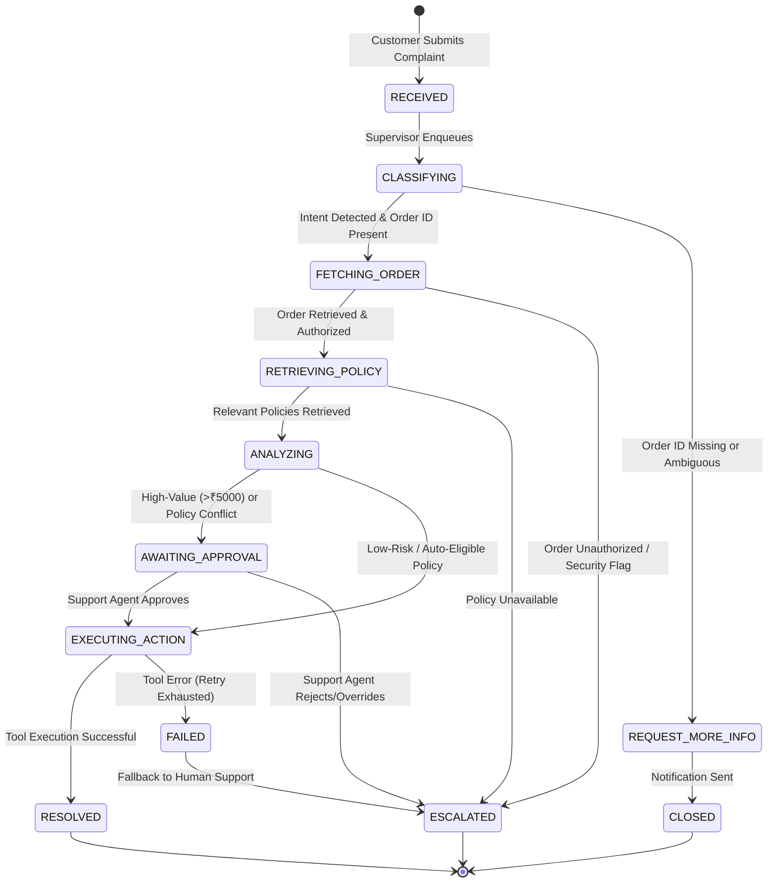

# Agent Workflow & State Machine Design

## 1. Overview
The complaint resolution process is modeled as an **asynchronous finite state machine (FSM)** governed by the **Supervisor Agent**. Rather than allowing specialized agents to freely chat or autonomously wander, the Supervisor Agent dictates state transitions, passes strictly typed context, monitors agent execution time, and records audit telemetry.

---

## 2. Finite State Machine Transitions



---

## 3. Agent Roles and Contract Specifications

### 3.1 Supervisor Agent
- **Inputs:** Complaint payload (Title, Description, Order ID, Customer ID).
- **Execution Responsibility:** Orchestrates execution pipeline, enforces timeouts (default 10s per agent), records latency per agent, checks approval conditions, and finalizes complaint state.
- **Fail-Safe Mechanism:** If any specialized agent encounters an unrecoverable exception or timeout, the Supervisor marks the step as failed, retries up to 2 times, and if failure persists, transitions the state to `ESCALATED`.

### 3.2 Intent Classification Agent
- **Model:** Structured output via Pydantic model `IntentClassificationOutput`.
- **Taxonomy:**
  - `REFUND`: Requesting monetary reimbursement.
  - `REPLACEMENT`: Requesting unit exchange for damaged/defective items.
  - `DAMAGED_PRODUCT`: Item arrived physically compromised.
  - `WRONG_PRODUCT`: Incorrect SKU or item delivered.
  - `ORDER_STATUS`: Inquiring regarding delivery ETA or package location.
  - `PAYMENT_ISSUE`: Double billing, failed transactions.
  - `DELIVERY_ISSUE`: Package delayed or marked delivered but not received.
  - `PRODUCT_ISSUE`: Technical malfunction within operational warranty.
  - `GENERAL_SUPPORT`: Miscellaneous customer queries.
  - `OTHER`: Unclassified input.
- **Entity Extraction:** Extracts `order_id`, `urgency`, and `priority` (`LOW`, `MEDIUM`, `HIGH`, `CRITICAL`).

### 3.3 Order Agent
- **Tools Invoked:**
  - `get_order_details(order_id)`: Fetches product name, SKU, price, status, delivery date, customer ID.
  - `get_order_status(order_id)`: Returns current logistics status and tracking checkpoint.
  - `get_customer_orders(customer_id)`: Lists all orders placed by the user.
- **Data Boundary Check:**
  ```python
  if order.customer_id != current_user.id and current_user.role != Role.ADMIN:
      raise AuthorizationError("Customer cannot access cross-tenant order data")
  ```

### 3.4 Policy / RAG Agent
- **Retrieval Engine:** ChromaDB semantic similarity search over enterprise policy documents (`data/policies/*.md`).
- **Pipeline:**
  1. Synthesizes a search query based on complaint intent and product category.
  2. Queries vector collection for top-$k$ relevant chunks (default $k=3$).
  3. Filters chunks based on similarity threshold ($>0.65$).
  4. Returns text evidence alongside metadata citations (`document_name`, `section`).

### 3.5 Resolution Agent
- **Reasoning Inputs:** Customer statement, classification, order metadata, policy chunks.
- **Decision Engine:**
  - *Scenario A (Damaged Good within 7 days, value $\le$ ₹10,000):* Proposes `AUTO_REPLACEMENT`. `requires_approval = False`.
  - *Scenario B (Refund request $\le$ ₹5,000):* Proposes `AUTO_REFUND`. `requires_approval = False`.
  - *Scenario C (Refund request $>$ ₹5,000):* Proposes `AUTO_REFUND` but marks `requires_approval = True`.
  - *Scenario D (Order Status Inquiry):* Proposes `ORDER_STATUS_RESPONSE`. `requires_approval = False`.
  - *Scenario E (Missing Order ID):* Proposes `REQUEST_MORE_INFORMATION`.

### 3.6 Action / Tool Agent
- **Registered Tools:**
  - `create_refund_request(complaint_id, order_id, amount, reason)` $\to$ `{"reference_id": "REF-XXXXX", "status": "PENDING_PAYOUT"}`
  - `create_replacement_request(complaint_id, order_id, sku, reason)` $\to$ `{"reference_id": "REP-XXXXX", "status": "DISPATCH_ENQUEUED"}`
  - `create_support_ticket(complaint_id, issue_type, priority)` $\to$ `{"reference_id": "TCK-XXXXX", "status": "ASSIGNED"}`
  - `update_complaint_status(complaint_id, status)` $\to$ `{"updated": True}`
  - `send_customer_notification(customer_id, message, channel)` $\to$ `{"delivered": True}`

---

## 4. Human-in-the-Loop (HITL) Workflow
When `requires_approval == True`:
1. Supervisor transitions complaint state to `AWAITING_APPROVAL`.
2. Creates an `Approval` record with `requested_action`, `amount`, and `policy_reason`.
3. Support Agent reviews via the Support Portal (`/support/approvals`).
4. Support Agent can:
   - **Approve:** Action Agent triggers the underlying tool; complaint state moves to `RESOLVED`.
   - **Reject:** Tool execution is cancelled; complaint moves to `ESCALATED` or `CLOSED` with reviewer feedback.
5. All reviewer actions are permanently recorded in the `AuditLog` collection.
