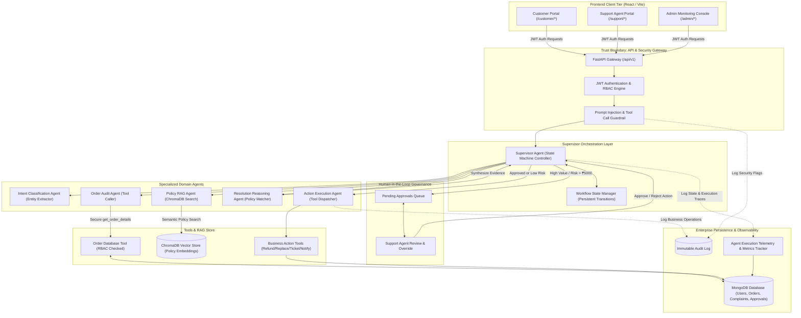

# Enterprise AI Customer Complaint Resolution Platform: Architecture Specification

## 1. Executive Architecture Overview
The **Enterprise AI Customer Complaint Resolution & Support Platform** is an enterprise-grade, agentic multi-tier platform that automates customer dispute triage, policy verification via Retrieval-Augmented Generation (RAG), order auditing via secure tool calling, and governed action execution with Human-in-the-Loop (HITL) approval gates.

Rather than relying on an unconstrained conversational chatbot, the system implements an **orchestrated multi-agent architecture** with deterministic state machine transitions, strict Role-Based Access Control (RBAC), and boundary guardrails.

---

## 2. System Architecture Diagram

---

## 3. Trust Boundaries & Security Enclaves

### 3.1 External to Gateway Boundary (Boundary 1)
- **Context:** Public network requests from browser clients.
- **Enforcement:** HTTPS, CORS headers, rate limiting, and JWT bearer token extraction.
- **Zero Trust Rule:** No request enters internal services without signature verification and role verification (`CUSTOMER`, `SUPPORT_AGENT`, `ADMIN`).

### 3.2 Gateway to Agent Boundary (Boundary 2)
- **Context:** Sanitized HTTP request dispatching into the supervisor workflow.
- **Enforcement:** Pydantic schema validation, Prompt Injection Guardrail filters (e.g. searching for system prompt overrides, payload injection patterns, and delimiter escapes).
- **Audit:** Any flagged input triggers an automatic security audit log and redirects the workflow to human review or rejection.

### 3.3 Agent to Data Access Boundary (Boundary 3)
- **Context:** Order Agent and Tools interacting with data stores.
- **Enforcement:** Code-enforced authorization filters. The LLM cannot craft raw SQL/NoSQL queries. Tools accept structured parameters and enforce:
  $$\text{Target Order Customer ID} == \text{Current Authenticated User ID}$$
  Customers cannot view, query, or affect orders belonging to other customers.

### 3.4 Agent to Action Execution Boundary (Boundary 4)
- **Context:** Dispatching financial or operational state changes (Refunds, Replacements).
- **Enforcement:** Policy threshold gates:
  - If $\text{Refund Amount} > ₹5,000 \implies \text{AWAITING\_APPROVAL}$
  - If $\text{Replacement Value} > ₹10,000 \implies \text{AWAITING\_APPROVAL}$
  - Automated tools can only be invoked if policy criteria are satisfied and approval is recorded.

---

## 4. Subsystem Breakdown

| Subsystem | Role | Key Technologies |
| :--- | :--- | :--- |
| **Frontend Tier** | Responsive enterprise portal for Customers, Support Agents, and Admins. | React 18, Vite, React Router 6, Plain CSS, Axios |
| **API Gateway** | REST API routing, Auth, RBAC, Guardrails, and CORS handling. | FastAPI, Pydantic v2, PyJWT, Passlib |
| **Agent Supervisor** | Orchestrates domain agents through an explicit finite state machine. | Python Asyncio, Structured Output Schema |
| **Domain Agents** | Intent Classification, Order Verification, Policy RAG, Resolution Planning, Action Execution. | LLM Abstraction (OpenAI/Gemini/Claude/Demo Provider) |
| **Vector Store** | Ingests, embeds, and indexes company policy markdown files for RAG. | ChromaDB (with local fallback vector similarity engine) |
| **Persistence Store** | Stores Users, Orders, Complaints, Approvals, and Audit Logs. | MongoDB (with reliable in-memory mock repository fallback) |
| **Telemetry & Metrics** | Real-time tracking of agent durations, tool calls, costs, and security events. | Custom In-Memory & DB Metric Aggregators |
