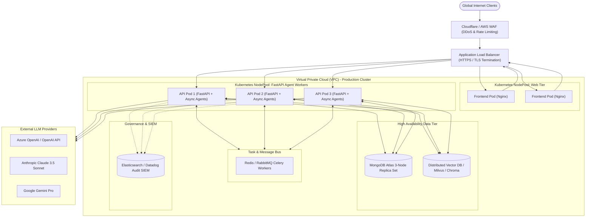

# Deployment Strategy & Production Scaling Architecture

## 1. Overview
This document specifies the deployment architecture for the **Enterprise AI Customer Complaint Resolution Platform**, describing both the local academic demonstration setup and the enterprise production blueprint.

---

## 2. Local Academic Development Setup
For local evaluation and demonstration, the stack operates with minimal overhead:
- **Frontend:** Vite Dev Server running React at `http://localhost:5173` (with proxy to backend `http://localhost:8000`).
- **Backend:** FastAPI running under Uvicorn at `http://localhost:8000`.
- **Database:** Local MongoDB instance at `mongodb://localhost:27017/enterprise_ai_support` or internal in-memory fallback store when MongoDB is not running (`DEMO_MODE=true`).
- **Vector DB:** Embedded ChromaDB directory (`./data/chroma_db`) or in-memory vector cosine index.

---

## 3. Containerized Deployment (Docker & Compose)

### 3.1 Multi-Container Topology
The application includes a production-ready `docker-compose.yml` comprising three core services:
1. `frontend`: Node/Nginx lightweight container serving the optimized React static build.
2. `backend`: Python 3.11/3.14 slim container hosting FastAPI, multi-agent engine, and tools.
3. `mongodb`: Official MongoDB 7.0 container with persistent volume mounting.

```yaml
version: '3.8'

services:
  mongodb:
    image: mongo:7.0
    restart: unless-stopped
    ports:
      - "27017:27017"
    volumes:
      - mongo_data:/data/db

  backend:
    build:
      context: .
      dockerfile: Dockerfile.backend
    ports:
      - "8000:8000"
    environment:
      - MONGODB_URI=mongodb://mongodb:27017
      - DATABASE_NAME=enterprise_ai_support
      - DEMO_MODE=true
      - JWT_SECRET=enterprise_super_secret_jwt_key_2026
    depends_on:
      - mongodb

  frontend:
    build:
      context: ./frontend
      dockerfile: Dockerfile.frontend
    ports:
      - "3000:80"
    depends_on:
      - backend

volumes:
  mongo_data:
```

---

## 4. Production Enterprise Architecture Concept



---

## 5. Horizontal Scaling, Health Checks & Resilience

### 5.1 Horizontal Auto-Scaling (HPA)
- API and Agent Worker pods scale horizontally based on CPU utilization ($>70\%$) and active request queue length.
- Agent calls are stateless; workflow states are persisted in MongoDB after every step, allowing any pod in the cluster to resume an inflight complaint workflow.

### 5.2 Health Checks & Liveness
- **Liveness Probe:** `GET /api/health` validates FastAPI event loop and process status.
- **Readiness Probe:** `GET /api/health/ready` verifies connectivity to MongoDB and ChromaDB vector store before admitting traffic.

### 5.3 Rolling Updates & Zero-Downtime Releases
- Kubernetes RollingUpdate strategy ensures maximum unavailable pods is 0 during deployment.
- Blue/Green deployments are utilized when upgrading LLM system prompts or agent taxonomy to prevent version skew.
